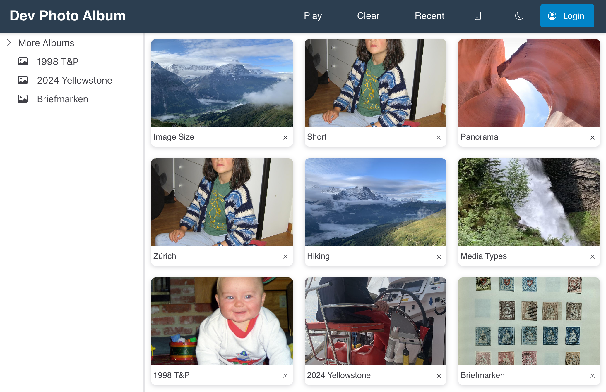

# Photo Web

Photo Web provides a secure, web-based interface for accessing your Apple Photos library and static files.



## Installation

### Requirements

**Note:** all accounts are **free**, except for the need to purchase a domain name (about \$10/year, depending on name).

1. Server with access to Apple Photos library. On MacOS the library is usually at `/Users/<user-name>/Pictures/Photos Library.photoslibrary` and synchronized automatically via [iCloud](https://www.icloud.com/). Serving from e.g. Linux should be possible, but I have not tried it (iCloud is a bit special :smile:). A (recycled) Mac Mini works well.

2. Docker and docker compose (installed on the server). E.g. [Docker Desktop](https://docs.docker.com/desktop/) on the Mac.

3. `npm`. Install with `brew install node`.

4. A [Cloudflare Account](https://www.cloudflare.com/). Used for domain name registration and global access to the app (if desired).

5. A [Firebase Account](https://firebase.google.com/). Used for user authentication (with Google).

6. [Mkdocs](https://www.mkdocs.org/user-guide/installation/) installation (to create the documentation, if desired).

### Steps

#### Clone the Repository

Go to the folder where you want to install photo-web and clone the source from github:

```{bash}
git clone https://github.com/iot49/photo-web.git
cd photo-web
cp .env.example .env
```

#### Get a Domain Name

Login to [Cloudflare](https://www.cloudflare.com/) and purchase a domain name, e.g. `your-domain.com`. Update `ROOT_DOMAIN` in the `.env` file.

> [!NOTE]
> All access to photo web is encrypted (i.e. https). Because of this a domain name is required even for local access.

> [!TIP]
> Modify the `traefik` configuration if you prefer a different registar.

#### Create a Cloudflare API Token (CF_API_TOKEN)

1. Go to [Cloudflare API Tokens](https://dash.cloudflare.com/profile/api-tokens)
2. Click "Create Token"
3. Use the "Custom token" template
4. Configure the token with these permissions:
   - **Zone:DNS:Edit** - for DNS challenge during SSL certificate generation
   - **Zone:Zone:Read** - to read zone information
5. Set **Zone Resources** to:
   - Include: Zone - `your-domain.com` (replace with your actual domain)
6. Click "Continue to summary" and then "Create Token"
7. Copy the generated token and update `CF_API_TOKEN` in your `.env` file

#### Create a Cloudflare Tunnel Token (CF_TUNNEL_TOKEN)

1. Go to [Cloudflare Zero Trust Dashboard](https://one.dash.cloudflare.com/)
2. Navigate to **Networks** → **Tunnels**
3. Click "Create a tunnel"
4. Choose "Cloudflared" as the connector type
5. Give your tunnel a name (e.g., "photo-web-tunnel")
6. Click "Save tunnel"
7. In the "Install and run a connector" section, copy the token from the command shown (it's the long string after `--token`)
8. Update `CF_TUNNEL_TOKEN` in your `.env` file with this token
9. In the "Route tunnel" section, configure:
   - **Public hostname**: your domain (e.g., `your-domain.com`)
   - **Service**: `http://traefik:81` (note: port 81, not 80)
10. Click "Save tunnel"
11. Add a second public hostname for subdomain `traefik` that also points to `http://traefik:81`

> [!NOTE]
> The tunnel token enables secure external access to your photo-web instance without opening ports on your firewall.

#### Create a Firebase App

1. Go to the [Firebase Console](https://console.firebase.google.com/)
2. Click "Create a project" or "Add project"
3. Enter a project name (e.g., "photo-web-auth")
4. Choose whether to enable Google Analytics (optional)
5. Click "Create project"

#### Enable Authentication

1. In your Firebase project, navigate to **Authentication** in the left sidebar
2. Click on the **Sign-in method** tab
3. Enable **Google** as a sign-in provider:
   - Click on "Google"
   - Toggle "Enable"
   - Enter your project's public-facing name
   - Select a support email
   - Click "Save"

#### Create Firebase Service Account (for Server)

1. In the Firebase Console, click the gear icon ⚙️ next to "Project Overview"
2. Select **Project settings**
3. Go to the **Service accounts** tab
4. Click **Generate new private key**
5. Click **Generate key** to download the JSON file
6. Save this file as `auth/app/service-account.json` in your photo-web directory

> [!IMPORTANT]
> Keep the service account key secure and never commit it to version control. This file contains sensitive credentials.

#### Get Firebase Client Configuration

1. In the Firebase Console, go to **Project settings** (gear icon ⚙️)
2. Scroll down to the **Your apps** section
3. Click **Add app** and select the **Web** platform (</> icon)
4. Register your app with a nickname (e.g., "photo-web-client")
5. Copy the Firebase configuration object that looks like this:

   ```javascript
   const firebaseConfig = {
      apiKey: "your-api-key",
      authDomain: "your-project.firebaseapp.com",
      projectId: "your-project-id",
      storageBucket: "your-project.appspot.com",
      messagingSenderId: "123456789",
      appId: "1:123456789:web:abcdef123456"
   };
   ```

6. Create a file `auth/firebase-secrets/firebase-config.json` with this configuration:

   ```json
   {
     "apiKey": "your-api-key",
     "authDomain": "your-project.firebaseapp.com",
     "projectId": "your-project-id",
     "storageBucket": "your-project.appspot.com",
     "messagingSenderId": "123456789",
     "appId": "1:123456789:web:abcdef123456"
   }
   ```

#### Configure Authorized Domains

> [!TIP]
> If you can't find the right section, try asking Gemini. I find it exceedingly difficult to navigate the Firebase console.

1. In the Firebase Console, go to **Overview** → **Authentication** → **Get Started** → **Settings** → **Authorized domains**
2. Add your domain (the one you registered with Cloudflare) to the authorized domains list
3. For local development, `localhost` should already be included

> [!NOTE]
> The Firebase configuration files (`service-account.json` and `firebase-config.json`) are required for the authentication service to work properly. The service account key is used for server-side Firebase Admin SDK operations, while the client configuration is served to the frontend for user authentication.
>

#### Create Service Account Configuration File

1. Head to Project Settings: In your Firebase console for the bg-photo-web project, look for the little gear icon (Settings) next to "Project overview" in the left-hand navigation bar. Click on it, then select "Project settings"
2. Navigate to Service Accounts: Once you're in Project settings, click on the "Service accounts" tab. This is where you'll manage the service accounts associated with your project.
3. Generate a New Private Key: On the "Service accounts" page, you'll see information about your default service account. To get your service-account.json file, look for a button that says "Generate new private key" or something similar. Click this button.
4. Confirm and Download: A confirmation prompt will appear. Click "Generate key" (or "Generate new private key") again to confirm. Your browser will then automatically download a JSON file. This is your service-account.json file (it might have a slightly different name initially, like bg-photo-web-firebase-adminsdk-xxxxx-xxxxxx.json). Copy this file to `auth/firebase-secrets/service-account.json`

### Start the App

Go to the `photo-web/ui` folder and run the following commands from the terminal:

```bash
npm install
npm run build
docker compose build
docker compose up -d
docker compose logs -f
```

Check the log for errors. If everything goes well, you should be able to access the app from anywhere in the world under the domain you purchased, e.g. `https://your-domain.com`.

Repeat these steps to restart the app. For shutting down, run

```bash
docker compose down
```

Optionally (and for better efficiency), set up a local DNS server to point your domain to the server photo-web is running on. Many routers have build-in DNS servers that can do this. Now when accessing photo-web locally, all traffic is handled locally. Depending on your internet connection you may see faster speed. Away from home Cloudflare takes care of forwarding access from the internet to your server.

Optionally build the documentation. From the project root run

```bash
mkdocs build
```

The documentation will be available at `https://<your-domain>/static/docs/`.

## Architecture

The [Project Brief](./projectBrief.md) provides a concise overview. The AI generated documentation in the `./docs` (render with `mkdocs build`) a rather *extensive* AI generated discussion.
