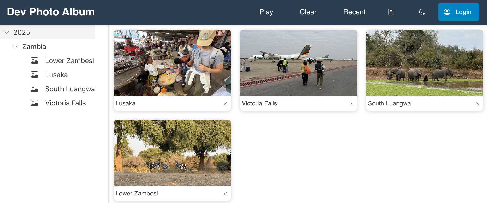

# Photo Web

Photo Web provides a secure, web-based interface for accessing your Apple Photos library and static files.



## Installation

### Requirements

**Note:** All required accounts are **free**, except for a domain name (~$10/year).

1. Server with access to Apple Photos library. On macOS, the library is typically at `/Users/<user-name>/Pictures/Photos Library.photoslibrary` and syncs automatically via [iCloud](https://www.icloud.com/). Linux deployment is possible but untested (consider [icloud-docker](https://github.com/mandarons/icloud-docker)). A Mac Mini works well for this purpose.
   
   **Important:** On Mac, go to System Settings → Privacy & Security → Full Disk Access and **enable Docker**. The photos library mounts read-only, but Docker requires full access.

2. [Docker Desktop](https://docs.docker.com/desktop/) with Docker Compose

3. Node.js and npm (`brew install node` on Mac)

4. [Cloudflare Account](https://www.cloudflare.com/) for domain registration and global access

5. [Firebase Account](https://firebase.google.com/) for Google authentication

6. [MkDocs](https://www.mkdocs.org/user-guide/installation/) (optional, for documentation)

### Steps

#### Clone the Repository

Navigate to your desired installation directory and clone the repository:

```{bash}
git clone https://github.com/iot49/photo-web.git
cd photo-web
cp .env.example .env
```

#### Get a Domain Name

Log in to [Cloudflare](https://www.cloudflare.com/), purchase a domain (e.g., `your-domain.com`), and update `ROOT_DOMAIN` in the `.env` file.

> [!NOTE]
> All access uses HTTPS encryption, requiring a domain name even for local access.

> [!TIP]
> Modify the Traefik configuration to use a different registrar.

#### Create a Cloudflare API Token (CF_API_TOKEN)

1. Go to [Cloudflare API Tokens](https://dash.cloudflare.com/profile/api-tokens)
2. Click "Create Token"
3. Use the "Custom token" template
4. Configure the token with these permissions:
   - **Zone:DNS:Edit** - for DNS challenge during SSL certificate generation
   - **Zone:Zone:Read** - to read zone information
5. Set **Zone Resources** to:
   - Include: Zone - `your-domain.com` (replace with your actual domain)
6. Click "Continue to summary" and then "Create Token"
7. Copy the generated token and update `CF_API_TOKEN` in your `.env` file

#### Create a Cloudflare Tunnel Token (CF_TUNNEL_TOKEN)

1. Go to [Cloudflare Zero Trust Dashboard](https://one.dash.cloudflare.com/)
2. Navigate to **Networks** → **Tunnels**
3. Click "Create a tunnel"
4. Choose "Cloudflared" as the connector type
5. Give your tunnel a name (e.g., "photo-web-tunnel")
6. Click "Save tunnel"
7. In the "Install and run a connector" section, copy the token from the command shown (it's the long string after `--token`)
8. Update `CF_TUNNEL_TOKEN` in your `.env` file with this token
9. In the "Route tunnel" section, configure:
   - **Public hostname**: your domain (e.g., `your-domain.com`)
   - **Service**: `http://traefik:81` (note: port 81, not 80)
10. Click "Save tunnel"
11. Add a second public hostname for subdomain `traefik` that also points to `http://traefik:81`

> [!NOTE]
> The tunnel token enables secure external access to your photo-web instance without opening ports on your firewall.

#### Create a Firebase App

1. Go to the [Firebase Console](https://console.firebase.google.com/)
2. Click "Create a project" or "Add project"
3. Enter a project name (e.g., "photo-web-auth")
4. Choose whether to enable Google Analytics (optional)
5. Click "Create project"

#### Enable Authentication

1. In your Firebase project, navigate to **Authentication** in the left sidebar
2. Click on the **Sign-in method** tab
3. Enable **Google** as a sign-in provider:
   - Click on "Google"
   - Toggle "Enable"
   - Enter your project's public-facing name
   - Select a support email
   - Click "Save"

#### Create Firebase Service Account (for Server)

1. In the Firebase Console, click the gear icon ⚙️ next to "Project Overview"
2. Select **Project settings**
3. Go to the **Service accounts** tab
4. Click **Generate new private key**
5. Click **Generate key** to download the JSON file
6. Save this file as `auth/app/service-account.json` in your photo-web directory

> [!IMPORTANT]
> Keep the service account key secure and never commit it to version control. This file contains sensitive credentials.

#### Get Firebase Client Configuration

1. In the Firebase Console, go to **Project settings** (gear icon ⚙️)
2. Scroll down to the **Your apps** section
3. Click **Add app** and select the **Web** platform (</> icon)
4. Register your app with a nickname (e.g., "photo-web-client")
5. Copy the Firebase configuration object that looks like this:

   ```javascript
   const firebaseConfig = {
      apiKey: "your-api-key",
      authDomain: "your-project.firebaseapp.com",
      projectId: "your-project-id",
      storageBucket: "your-project.appspot.com",
      messagingSenderId: "123456789",
      appId: "1:123456789:web:abcdef123456"
   };
   ```

6. Create a file `auth/firebase-secrets/firebase-config.json` with this configuration:

   ```json
   {
     "apiKey": "your-api-key",
     "authDomain": "your-project.firebaseapp.com",
     "projectId": "your-project-id",
     "storageBucket": "your-project.appspot.com",
     "messagingSenderId": "123456789",
     "appId": "1:123456789:web:abcdef123456"
   }
   ```

#### Configure Authorized Domains

> [!TIP]
> The Firebase console can be challenging to navigate. Use search or the built-in Gemini assistant.

1. In the Firebase Console, go to **Overview** → **Authentication** → **Get Started** → **Settings** → **Authorized domains**
2. Add your domain (the one you registered with Cloudflare) to the authorized domains list
3. For local development, `localhost` should already be included

> [!NOTE]
> The Firebase configuration files (`service-account.json` and `firebase-config.json`) are required for the authentication service to work properly. The service account key is used for server-side Firebase Admin SDK operations, while the client configuration is served to the frontend for user authentication.
>

#### Create Service Account Configuration File

1. **Access Project Settings:** Click the gear icon ⚙️ next to "Project overview" and select "Project settings"
2. **Navigate to Service Accounts:** Click the "Service accounts" tab
3. **Generate Private Key:** Click "Generate new private key"
4. **Download and Save:** Confirm by clicking "Generate key" again. Save the downloaded JSON file as `auth/firebase-secrets/service-account.json`

### Start the App

Navigate to the `photo-web/ui` directory and run:

```bash
npm install
npm run build
docker compose build
docker compose up -d
docker compose logs -f
```

Check the logs for errors. If successful, access your app globally at `https://your-domain.com`.

To restart the app, repeat the above steps. To shut down:

```bash
docker compose down
```

**Optional:** Configure your router's DNS to point your domain to the local server for faster local access. Point both `your-domain.com` and `traefik.your-domain.com` to the server (the latter for Traefik dashboard access).

**Optional:** Build documentation from the project root:

```bash
pip install mkdocs>=1.5.0
pip install mkdocs-material>=9.0.0
pip install pymdownx-extensions>=10.0.0
mkdocs build --clean
```

The documentation will be available at `https://<your-domain>/static/docs/`.

### Updating

To update to the latest version from GitHub:

```bash
git pull
docker compose build
docker compose up -d
mkdocs build
cd ui && npm install && npm run build
```

## Architecture

The [Project Brief](./projectBrief.md) provides a concise overview. The `./docs` directory contains extensive AI-generated documentation (build with `mkdocs build`).
