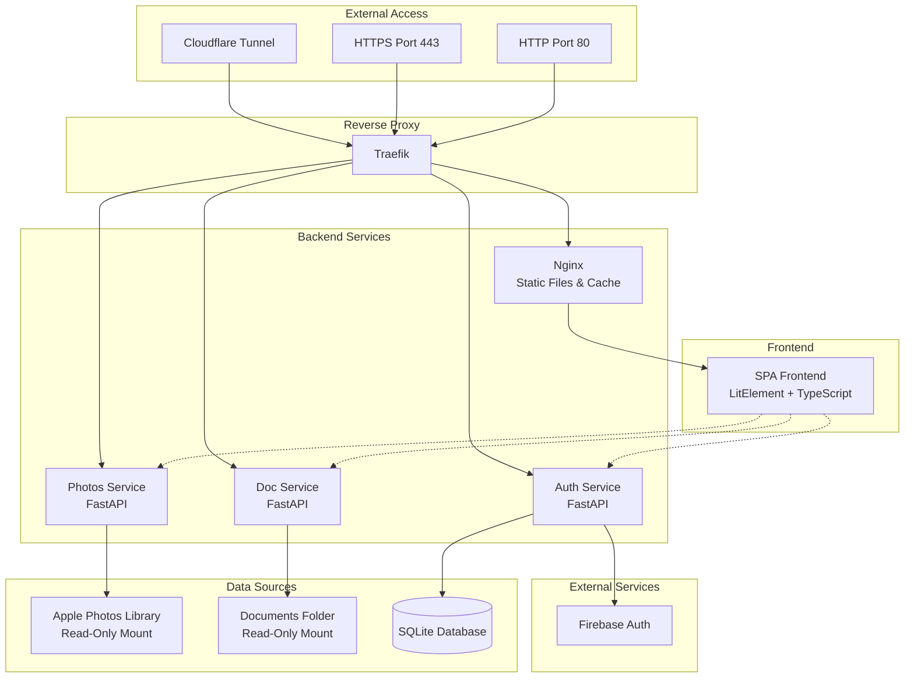
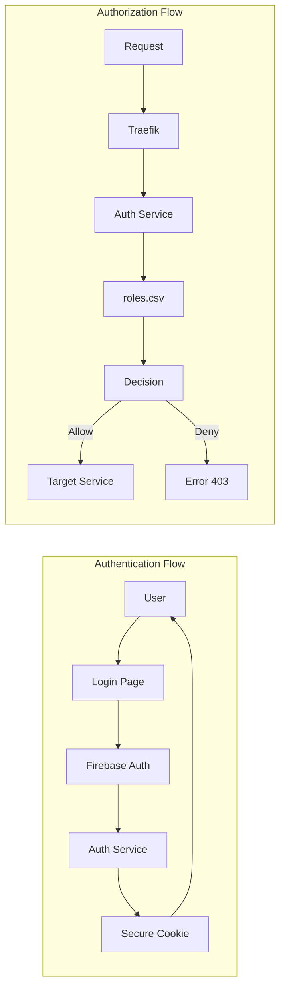
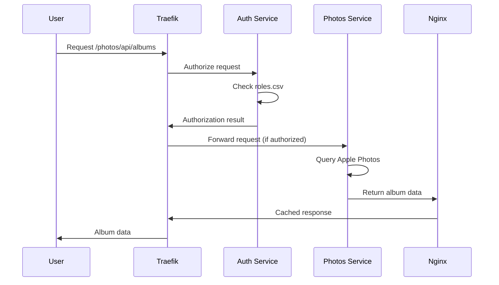

# Architecture Overview

Photo Web is built as a microservices architecture using Docker containers orchestrated with Docker Compose. The system provides secure, role-based access to Apple Photos libraries and document collections through a modern web interface.

## System Architecture

## Core Components

### Traefik (Reverse Proxy)
- **Purpose**: Single entry point for all external traffic
- **Features**: 
  - HTTPS termination with automatic certificate management
  - HTTP to HTTPS redirection
  - Request routing to backend services
  - Integration with auth service for authorization

### Authentication Service
- **Technology**: FastAPI with SQLite database
- **Responsibilities**:
  - Firebase authentication integration
  - Role-based authorization
  - Session management with secure cookies
  - User management and role assignment

### Photos Service
- **Technology**: FastAPI with direct Apple Photos library access
- **Responsibilities**:
  - Album and photo metadata serving
  - Real-time image processing (scaling, format conversion)
  - Role-based photo access control
  - Integration with OSXPhotos library

### Documents Service
- **Technology**: FastAPI with file system access
- **Responsibilities**:
  - Document browsing and serving
  - Support for markdown, PDF, and other formats
  - Folder-based access control

### Frontend Application
- **Technology**: TypeScript SPA with LitElement and Shoelace
- **Features**:
  - Responsive design with modern UI components
  - Photo album browsing with slideshow capabilities
  - Document viewer with format-specific rendering
  - User authentication and role management

### Nginx
- **Purpose**: Static file serving and caching
- **Features**:
  - Frontend application delivery
  - Image caching for performance optimization
  - Static asset serving

## Security Architecture

### Access Control Levels

| Role | Access Level | Description |
|------|-------------|-------------|
| `public` | Public content | All visitors, no authentication required |
| `protected` | Protected content | Authenticated users only |
| `private` | Private content | Explicitly assigned users only |
| `admin` | Administrative | Full system access and user management |

### Security Features

- **HTTPS Only**: All communication encrypted, no HTTP access allowed
- **Certificate Validation**: Proper SSL/TLS certificates required
- **Session Management**: Secure cookies with configurable expiration
- **Role-Based Access**: Granular permissions based on user roles
- **Firebase Integration**: Leverages Google's authentication infrastructure

## Data Flow

## Deployment Architecture

The application is designed for containerized deployment with:

- **Development**: Local Docker Compose setup
- **Production**: Docker Compose with Cloudflare tunnel
- **Scaling**: Individual service scaling capabilities
- **Monitoring**: Container logs and health checks

## Performance Considerations

- **Image Caching**: Nginx caches processed images for faster delivery
- **On-Demand Processing**: Images scaled and converted only when requested
- **Static Assets**: Frontend served efficiently through Nginx
- **Database**: Lightweight SQLite for user and session data