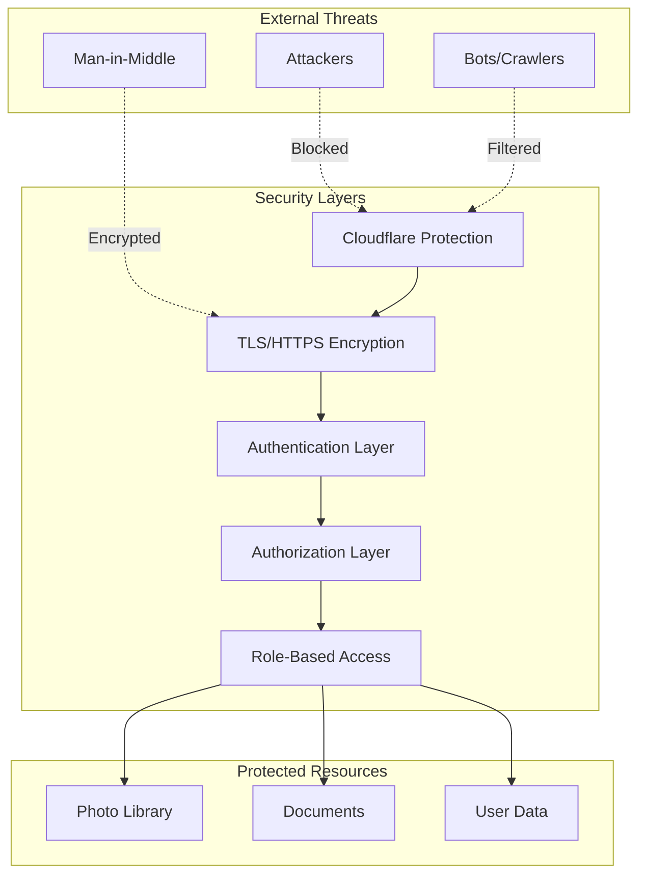
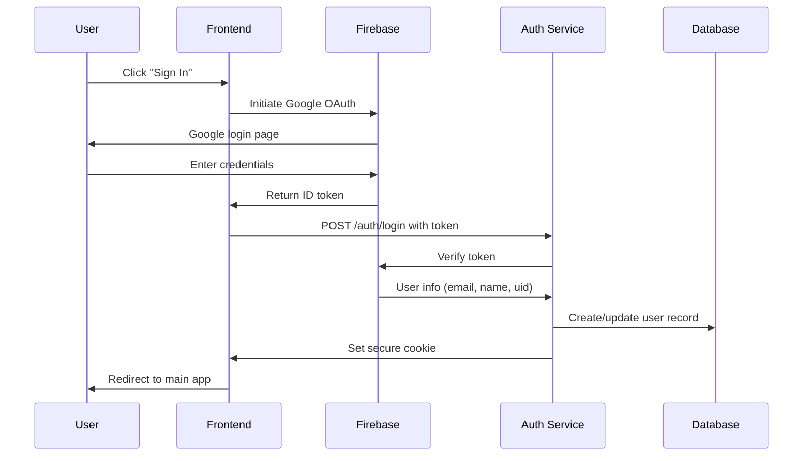
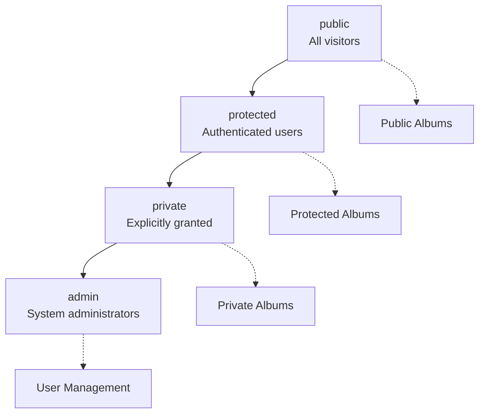
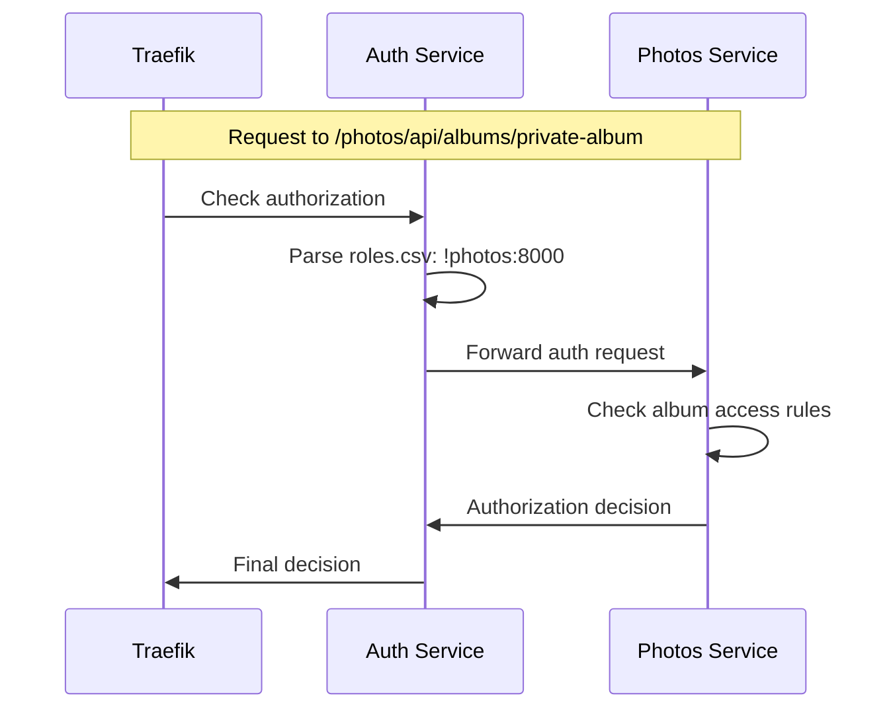
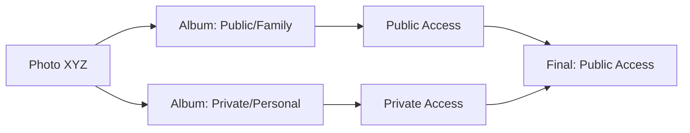
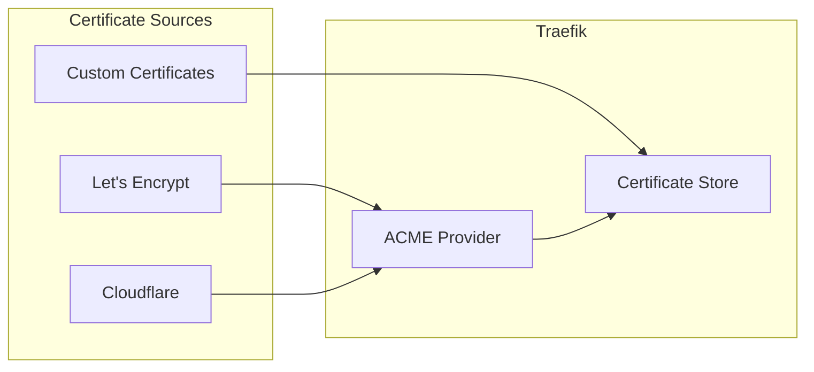
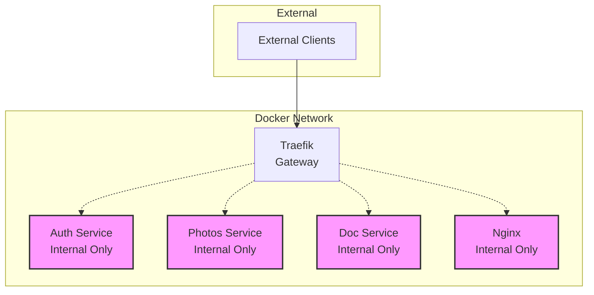
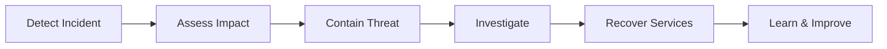

# Security Architecture

Photo Web implements a comprehensive security model designed to protect user data and ensure secure access to photo libraries and documents.

## Security Overview



## Authentication

### Firebase Integration

Photo Web leverages Google Firebase for robust authentication:

- **OAuth 2.0**: Industry-standard authentication protocol
- **Google Sign-In**: Secure authentication via Google accounts
- **Token Validation**: Server-side token verification
- **Session Management**: Secure cookie-based sessions

### Authentication Flow



### Session Management

- **Secure Cookies**: HttpOnly, Secure, SameSite attributes
- **Configurable Expiration**: Default 30 days (AUTH_COOKIE_EXPIRATION_DAYS)
- **Automatic Renewal**: Sessions renewed on activity
- **Secure Logout**: Complete session cleanup

## Authorization

### Role-Based Access Control (RBAC)

Photo Web implements a flexible RBAC system using the `roles.csv` configuration file:

```csv
action,route_pattern,role,comment
allow,/,public,main entry point
allow,/ui*,public,user interface
allow,/auth/login*,public,login page
allow,/photos/api/albums,public,public album list
allow,/photos/api/albums/*,!photos:8000,delegate to photos service
allow,/photos/api/photos/*,!photos:8000,delegate photo access
deny,/admin/*,public,block admin access for public users
allow,/admin/*,admin,admin interface access
```

### Authorization Rules

| Component | Description |
|-----------|-------------|
| **action** | `allow` or `deny` |
| **route_pattern** | URL pattern with wildcard support |
| **role** | Required role or delegation (`!service:port`) |
| **comment** | Human-readable description |

### Role Hierarchy



### Delegation Model

Services can delegate authorization decisions to other services:



## Content Access Control

### Photo Album Security

Albums are classified based on their folder structure in Apple Photos:

| Folder | Required Role | Access Level |
|--------|---------------|--------------|
| **Public** | `public` | All visitors |
| **Protected** | `protected` | Authenticated users |
| **Private** | `private` | Explicitly granted users |

!!! warning "Album Security Model"
    The public/protected/private access model is deeply integrated into the photos service. Modifying this structure requires significant refactoring.

### Document Security

Documents are secured based on their folder location:

```
${DOCS}/
├── Public/          # public role required
├── Protected/       # protected role required
├── Private/         # private role required
└── Admin/           # admin role required
```

### Photo Access Rules

Individual photo access is determined by the most permissive album containing the photo:



## Transport Security

### HTTPS Enforcement

- **TLS 1.2+**: Modern encryption standards
- **Certificate Validation**: Proper SSL/TLS certificates required
- **HSTS Headers**: HTTP Strict Transport Security
- **No HTTP Access**: All HTTP redirected to HTTPS

### Certificate Management



## Data Protection

### Sensitive Data Handling

| Data Type | Protection Method |
|-----------|------------------|
| **User Credentials** | Never stored, delegated to Firebase |
| **Session Tokens** | Encrypted cookies with secure attributes |
| **User Roles** | Stored in SQLite with access controls |
| **Photo Metadata** | Read-only access, no data modification |
| **Documents** | Read-only access, folder-based permissions |

### Database Security

- **SQLite Database**: Local file with restricted permissions
- **No Network Access**: Database not exposed externally
- **Minimal Data**: Only essential user and session data stored
- **Regular Cleanup**: Expired sessions automatically removed

## Network Security

### Internal Communication



### Firewall Rules

- **External Access**: Only ports 80 and 443 exposed
- **Internal Services**: No direct external access
- **Service Communication**: Docker network isolation
- **Cloudflare Tunnel**: Additional layer of protection

## Security Best Practices

### Development Security

1. **Secrets Management**: Never commit secrets to version control
2. **Environment Variables**: Use `.env` files for configuration
3. **Code Review**: Security-focused code reviews
4. **Dependency Updates**: Regular security updates

### Operational Security

1. **Regular Updates**: Keep all components updated
2. **Log Monitoring**: Monitor for suspicious activity
3. **Access Reviews**: Regular review of user roles
4. **Backup Security**: Secure backup procedures

### Incident Response



## Security Configuration

### Required Environment Variables

```bash
# Authentication
FIREBASE_PROJECT_ID=your-project-id
AUTH_COOKIE_EXPIRATION_DAYS=30

# Domain Configuration
ROOT_DOMAIN=your-domain.com

# Service Security
TRAEFIK_ACME_EMAIL=admin@your-domain.com
```

### Security Headers

Traefik automatically adds security headers:

- `Strict-Transport-Security`
- `X-Content-Type-Options`
- `X-Frame-Options`
- `X-XSS-Protection`
- `Referrer-Policy`

## Compliance Considerations

### Data Privacy

- **Minimal Data Collection**: Only essential user data stored
- **User Consent**: Clear privacy policy and consent mechanisms
- **Data Retention**: Configurable session expiration
- **Right to Deletion**: User account deletion capabilities

### Access Logging

All access attempts are logged for security auditing:

```json
{
  "timestamp": "2024-01-15T10:30:00Z",
  "user": "user@example.com",
  "action": "access_album",
  "resource": "/photos/api/albums/family-vacation",
  "result": "allowed",
  "ip": "192.168.1.100"
}