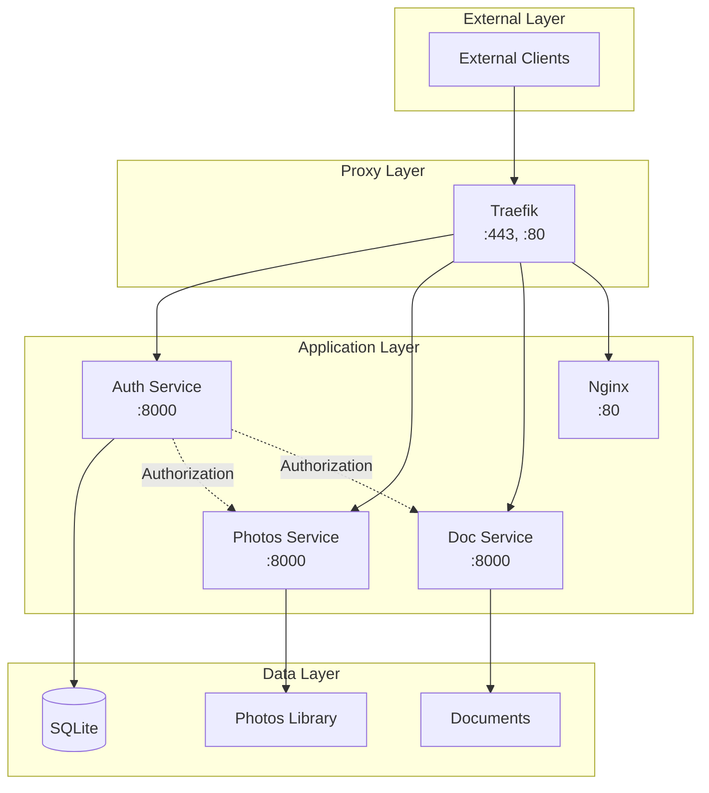
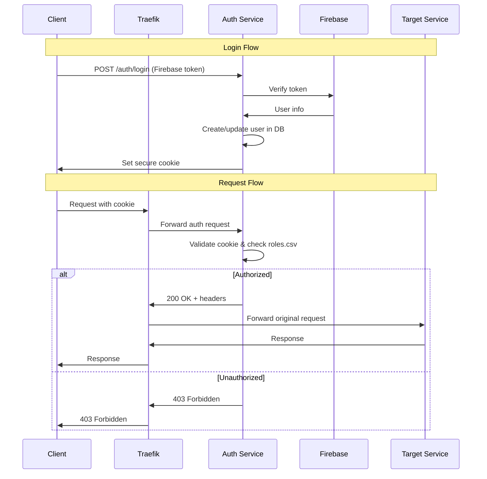
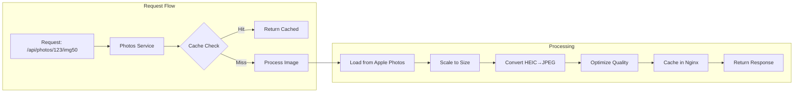
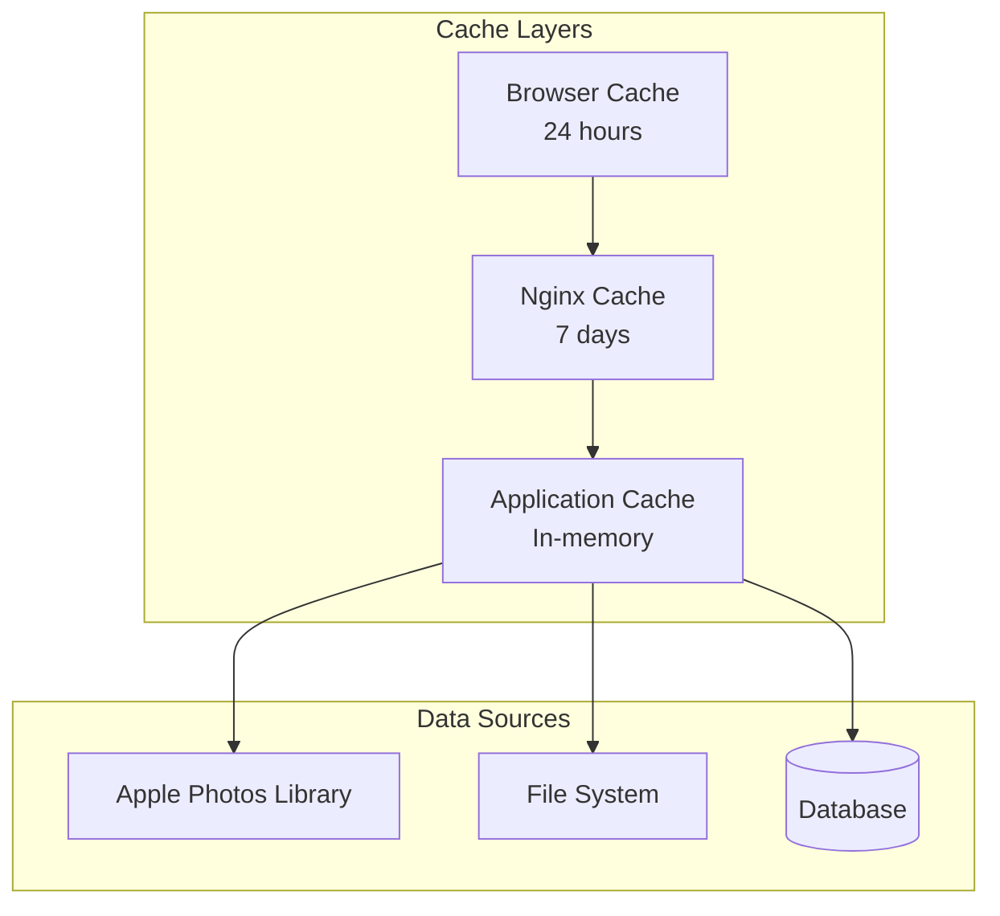
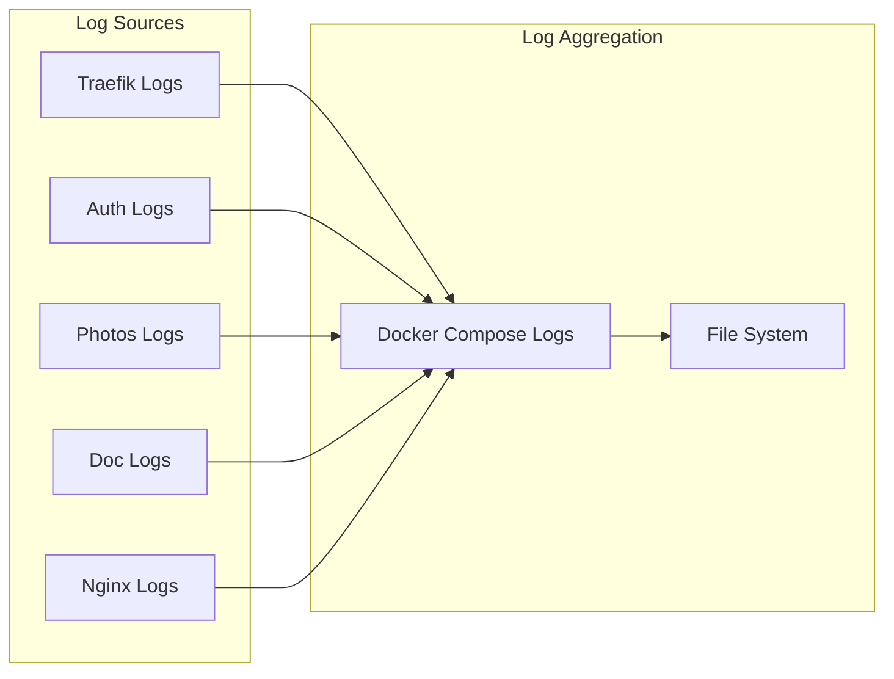

# System Design

This document details the technical design decisions and implementation patterns used in Photo Web.

## Design Principles

### Security First
- **HTTPS Everywhere**: No unencrypted communication allowed
- **Zero Trust**: Every request validated and authorized
- **Principle of Least Privilege**: Users get minimal required access
- **Defense in Depth**: Multiple security layers

### Microservices Architecture
- **Single Responsibility**: Each service has one clear purpose
- **Loose Coupling**: Services communicate via well-defined APIs
- **Independent Deployment**: Services can be updated independently
- **Technology Diversity**: Best tool for each job

### Performance Optimization
- **Lazy Loading**: Content loaded on demand
- **Caching Strategy**: Multiple cache layers for optimal performance
- **Resource Efficiency**: Minimal resource usage for maximum throughput

## Service Communication



## Authentication & Authorization Flow



## Data Models

### User Model
```python
class User:
    id: str              # Firebase UID
    email: str           # User email
    name: str            # Display name
    roles: List[str]     # Assigned roles
    created_at: datetime # Account creation
    last_login: datetime # Last login time
```

### Photo Album Model
```python
class Album:
    uuid: str           # Apple Photos UUID
    title: str          # Album title
    folder: str         # Folder classification (Public/Protected/Private)
    photo_count: int    # Number of photos
    cover_photo: str    # Cover photo UUID
    created_date: datetime
```

### Document Model
```python
class Document:
    path: str           # Relative file path
    name: str           # Display name
    type: str           # File type/extension
    size: int           # File size in bytes
    folder: str         # Access control folder
    modified_date: datetime
```

## Role-Based Access Control

### Authorization Matrix

| Resource Type | Public Role | Protected Role | Private Role | Admin Role |
|---------------|-------------|----------------|--------------|------------|
| UI Interface | ✅ | ✅ | ✅ | ✅ |
| Public Albums | ✅ | ✅ | ✅ | ✅ |
| Protected Albums | ❌ | ✅ | ✅ | ✅ |
| Private Albums | ❌ | ❌ | ✅ | ✅ |
| Public Documents | ✅ | ✅ | ✅ | ✅ |
| Protected Documents | ❌ | ✅ | ✅ | ✅ |
| Private Documents | ❌ | ❌ | ✅ | ✅ |
| User Management | ❌ | ❌ | ❌ | ✅ |
| System Admin | ❌ | ❌ | ❌ | ✅ |

### roles.csv Format

```csv
action,route_pattern,role,comment
allow,/,public,main entry point
allow,/ui*,public,user interface
allow,/auth/login*,public,login page
allow,/photos/api/albums,public,public album list
allow,/photos/api/albums/*,!photos:8000,delegate to photos service
deny,/admin/*,public,block admin access
allow,/admin/*,admin,admin interface
```

## Image Processing Pipeline



### Image Size Variants

| Suffix | Max Dimension | Quality | Use Case |
|--------|---------------|---------|----------|
| `img10` | 100px | 85% | Thumbnails |
| `img30` | 300px | 85% | Grid view |
| `img50` | 500px | 85% | Preview |
| `img85` | 850px | 90% | Detail view |
| `img100` | Original | 95% | Full resolution |

## Caching Strategy

### Multi-Layer Caching



### Cache Invalidation

- **Photos**: Cache invalidated on database reload
- **Documents**: Cache invalidated on file modification
- **User Data**: Cache invalidated on role changes
- **Static Assets**: Cache busting via version hashes

## Error Handling

### Error Response Format

```json
{
  "error": {
    "code": "UNAUTHORIZED",
    "message": "Access denied for this resource",
    "details": {
      "required_role": "private",
      "user_roles": ["public", "protected"]
    }
  }
}
```

### Error Categories

| Category | HTTP Code | Description |
|----------|-----------|-------------|
| Authentication | 401 | Invalid or missing credentials |
| Authorization | 403 | Insufficient permissions |
| Not Found | 404 | Resource does not exist |
| Validation | 400 | Invalid request format |
| Server Error | 500 | Internal system error |

## Monitoring & Observability

### Health Checks

Each service exposes health endpoints:
- `/health` - Basic service health
- `/health/ready` - Readiness for traffic
- `/health/live` - Liveness check

### Logging Strategy



### Metrics Collection

- **Request Metrics**: Response times, status codes, throughput
- **Resource Metrics**: CPU, memory, disk usage
- **Business Metrics**: User activity, content access patterns
- **Error Metrics**: Error rates, failure patterns