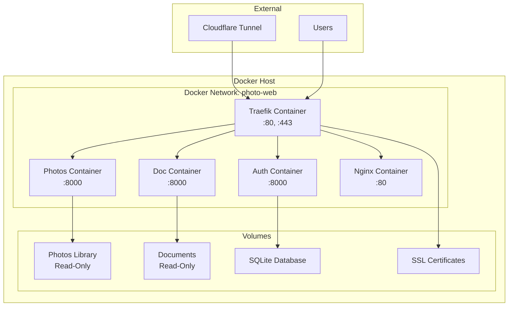

# Docker Deployment

Photo Web is designed for containerized deployment using Docker and Docker Compose. This guide covers production deployment strategies and configuration.

## Overview

The application consists of multiple Docker services orchestrated by Docker Compose:



## Production Deployment

### Prerequisites

- **Docker Engine**: Version 20.0 or later
- **Docker Compose**: Version 2.0 or later
- **System Resources**: Minimum 2GB RAM, 10GB disk space
- **Network Access**: Ports 80 and 443 available
- **Domain Name**: Valid domain with DNS configuration

### Environment Setup

#### 1. Create Production Environment File

```bash
# Create production environment
cp .env.example .env.production

# Edit production configuration
nano .env.production
```

**Production Environment Variables:**

```bash
# Domain Configuration
ROOT_DOMAIN=your-domain.com

# Firebase Configuration
FIREBASE_PROJECT_ID=your-production-project
AUTH_COOKIE_EXPIRATION_DAYS=30

# Data Sources
PHOTOS_LIBRARY_PATH=/data/photos/Photos Library.photoslibrary
DOCS_PATH=/data/filesuments

# Security
SESSION_SECRET_KEY=your-secure-random-key-here
TRAEFIK_ACME_EMAIL=admin@your-domain.com

# Performance
WORKER_PROCESSES=4
MAX_CONCURRENT_REQUESTS=100

# Logging
LOG_LEVEL=INFO
DEBUG=false

# Cloudflare (optional)
CLOUDFLARE_TUNNEL_TOKEN=your-tunnel-token
```

#### 2. Configure Data Volumes

```bash
# Create data directories
sudo mkdir -p /data/photos
sudo mkdir -p /data/filesuments
sudo mkdir -p /data/db

# Set appropriate permissions
sudo chown -R 1000:1000 /data/db
sudo chmod 755 /data/photos /data/filesuments
```

#### 3. SSL Certificate Configuration

**Option A: Let's Encrypt (Automatic)**

```yaml
# In docker-compose.yml
traefik:
  command:
    - --certificatesresolvers.letsencrypt.acme.email=${TRAEFIK_ACME_EMAIL}
    - --certificatesresolvers.letsencrypt.acme.storage=/certificates/acme.json
    - --certificatesresolvers.letsencrypt.acme.httpchallenge.entrypoint=web
```

**Option B: Custom Certificates**

```bash
# Place certificates in traefik/certs/
mkdir -p traefik/certs
cp your-domain.crt traefik/certs/
cp your-domain.key traefik/certs/
```

### Deployment Process

#### 1. Build and Deploy

```bash
# Clone repository
git clone <repository-url> photo-web-production
cd photo-web-production

# Configure environment
cp .env.production .env

# Build and start services
docker-compose -f docker-compose.yml -f docker-compose.prod.yml up -d

# Verify deployment
docker-compose ps
```

#### 2. Initial Setup

```bash
# Initialize database
docker-compose exec auth python -c "from app.database import init_db; init_db()"

# Load photos database
docker-compose exec photos python -c "from app.read_db import reload_db; reload_db()"

# Create admin user (manual process)
docker-compose exec auth python -c "
from app.models import User
from app.database import create_user
# Create admin user with appropriate roles
"
```

#### 3. Health Verification

```bash
# Check service health
curl https://your-domain.com/auth/health
curl https://your-domain.com/photos/health
curl https://your-domain.com/files/health

# Verify SSL certificate
openssl s_client -connect your-domain.com:443 -servername your-domain.com
```

## Production Configuration

### Docker Compose Override

Create `docker-compose.prod.yml` for production-specific settings:

```yaml
version: '3.8'

services:
  traefik:
    restart: unless-stopped
    volumes:
      - /var/run/filesker.sock:/var/run/filesker.sock:ro
      - ./traefik/certificates:/certificates
    environment:
      - TRAEFIK_ACME_EMAIL=${TRAEFIK_ACME_EMAIL}

  auth:
    restart: unless-stopped
    environment:
      - LOG_LEVEL=INFO
      - DEBUG=false
    deploy:
      resources:
        limits:
          memory: 512M
          cpus: '0.5'

  photos:
    restart: unless-stopped
    environment:
      - LOG_LEVEL=INFO
      - DEBUG=false
    deploy:
      resources:
        limits:
          memory: 1G
          cpus: '1.0'

  files:
    restart: unless-stopped
    environment:
      - LOG_LEVEL=INFO
      - DEBUG=false
    deploy:
      resources:
        limits:
          memory: 256M
          cpus: '0.25'

  nginx:
    restart: unless-stopped
    deploy:
      resources:
        limits:
          memory: 256M
          cpus: '0.25'
```

### Resource Limits

| Service | Memory Limit | CPU Limit | Purpose |
|---------|-------------|-----------|---------|
| Traefik | 256M | 0.25 | Reverse proxy |
| Auth | 512M | 0.5 | Authentication |
| Photos | 1G | 1.0 | Image processing |
| Doc | 256M | 0.25 | Document serving |
| Nginx | 256M | 0.25 | Static files |

### Security Hardening

#### 1. Container Security

```yaml
# Security-focused container configuration
services:
  auth:
    security_opt:
      - no-new-privileges:true
    read_only: true
    tmpfs:
      - /tmp
    user: "1000:1000"
```

#### 2. Network Security

```yaml
# Isolated network configuration
networks:
  photo-web:
    driver: bridge
    internal: false
    ipam:
      config:
        - subnet: 172.20.0.0/16
```

#### 3. Volume Security

```yaml
# Read-only volume mounts
volumes:
  - ${PHOTOS_LIBRARY_PATH}:/photos:ro
  - ${DOCS_PATH}:/filesuments:ro
  - ./auth/app/roles.csv:/app/roles.csv:ro
```

## Monitoring and Logging

### Log Configuration

```yaml
# Centralized logging
services:
  auth:
    logging:
      driver: "json-file"
      options:
        max-size: "10m"
        max-file: "3"
        labels: "service=auth"
```

### Health Checks

```yaml
# Health check configuration
services:
  auth:
    healthcheck:
      test: ["CMD", "curl", "-f", "http://localhost:8000/health"]
      interval: 30s
      timeout: 10s
      retries: 3
      start_period: 40s
```

### Monitoring Commands

```bash
# Monitor container status
docker-compose ps

# View logs
docker-compose logs -f [service]

# Monitor resource usage
docker stats

# Check disk usage
docker system df
```

## Backup and Recovery

### Database Backup

```bash
# Backup SQLite database
docker-compose exec auth cp /app/auth.db /backup/auth-$(date +%Y%m%d).db

# Automated backup script
#!/bin/bash
BACKUP_DIR="/backup/photo-web"
DATE=$(date +%Y%m%d-%H%M%S)

mkdir -p $BACKUP_DIR
docker-compose exec auth cp /app/auth.db $BACKUP_DIR/auth-$DATE.db
docker-compose exec -T auth sqlite3 /app/auth.db .dump > $BACKUP_DIR/auth-$DATE.sql
```

### Configuration Backup

```bash
# Backup configuration files
tar -czf photo-web-config-$(date +%Y%m%d).tar.gz \
  .env \
  docker-compose.yml \
  docker-compose.prod.yml \
  traefik/ \
  nginx/ \
  auth/app/roles.csv
```

### Recovery Process

```bash
# Stop services
docker-compose down

# Restore database
docker-compose exec auth cp /backup/auth-20240115.db /app/auth.db

# Restart services
docker-compose up -d

# Verify recovery
docker-compose logs -f
```

## Scaling and Performance

### Horizontal Scaling

```yaml
# Scale specific services
services:
  photos:
    deploy:
      replicas: 3
    depends_on:
      - auth
```

### Performance Optimization

#### 1. Nginx Caching

```nginx
# Enhanced caching configuration
location ~* \.(jpg|jpeg|png|gif|ico|css|js)$ {
    expires 1y;
    add_header Cache-Control "public, immutable";
    add_header Vary Accept-Encoding;
    gzip_static on;
}
```

#### 2. Database Optimization

```python
# Connection pooling configuration
DATABASE_CONFIG = {
    'pool_size': 20,
    'max_overflow': 30,
    'pool_timeout': 30,
    'pool_recycle': 3600
}
```

## Troubleshooting

### Common Issues

#### 1. Certificate Problems

```bash
# Check certificate status
docker-compose logs traefik | grep -i cert

# Manual certificate renewal
docker-compose exec traefik traefik version
```

#### 2. Service Communication

```bash
# Test internal connectivity
docker-compose exec auth curl http://photos:8000/health
docker-compose exec nginx curl http://auth:8000/health
```

#### 3. Performance Issues

```bash
# Monitor resource usage
docker stats --format "table {{.Container}}\t{{.CPUPerc}}\t{{.MemUsage}}"

# Check disk I/O
iostat -x 1
```

### Debug Mode

```bash
# Enable debug logging
echo "LOG_LEVEL=DEBUG" >> .env
docker-compose restart

# View detailed logs
docker-compose logs -f --tail=100
```

## Maintenance

### Regular Maintenance Tasks

```bash
# Weekly maintenance script
#!/bin/bash

# Update containers
docker-compose pull
docker-compose up -d

# Clean up unused resources
docker system prune -f

# Backup database
./backup-database.sh

# Check disk space
df -h

# Verify service health
curl -f https://your-domain.com/auth/health
```

### Updates and Upgrades

```bash
# Update application
git pull origin main
docker-compose build --no-cache
docker-compose up -d

# Rollback if needed
git checkout previous-tag
docker-compose up -d
```

This deployment guide ensures a robust, secure, and maintainable production environment for Photo Web.