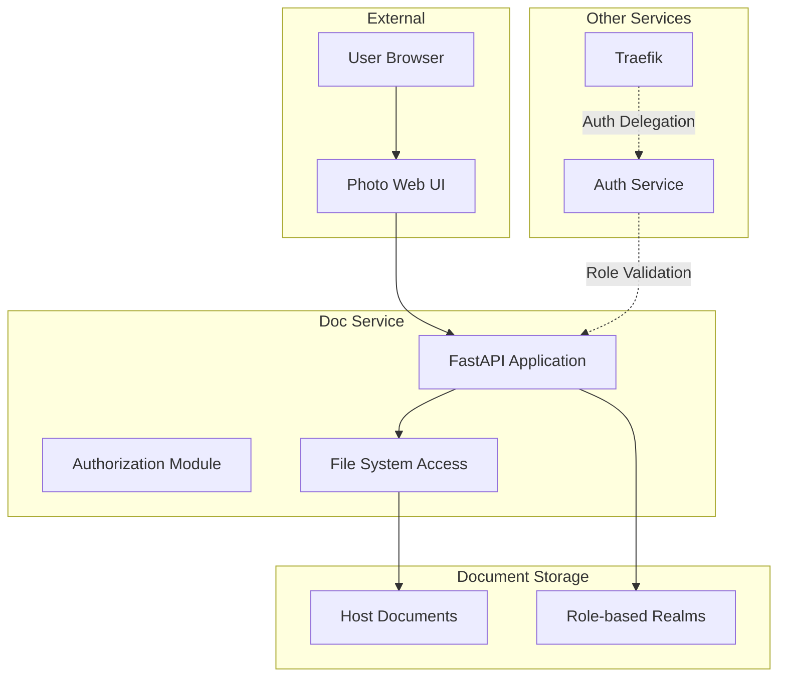
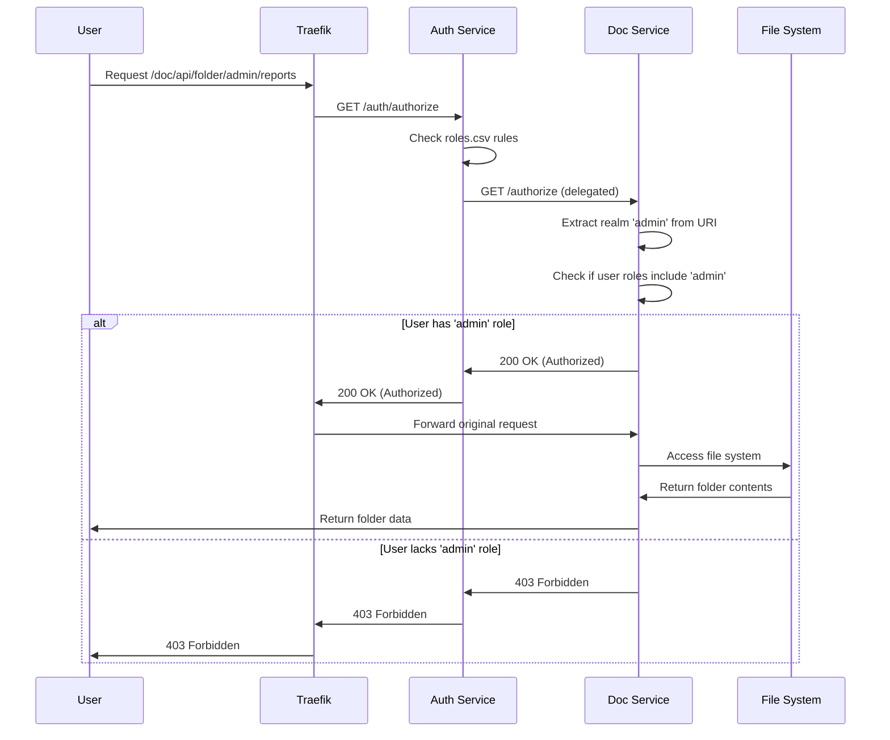

# Document Service

The Document Service provides secure access to document repositories for Photo Web, implementing role-based access control to expose different document collections based on user permissions.

## Overview

- **Technology**: FastAPI with file system access
- **Port**: 8000 (internal Docker network)
- **External Access**: `https://${ROOT_DOMAIN}/doc/*`
- **API Documentation**: Available at `/doc/docs` and `/doc/redoc`

## Architecture



## Core Components

### Document Access Model (`main.py`)

Provides role-based document access:

```python
@app.get("/api/root")
async def get_roots(request: Request) -> FolderModel:
    """Get folders users has access to based on roles"""
    roles = extract_roles_from_headers(request)
    # Return accessible document realms
```

### Authorization Module

Implements delegated authorization from auth service:

```python
@app.get("/authorize")
async def authorize_access(request: Request):
    """Authorization endpoint for delegated authorization"""
    # Extract realm from URI
    # Check if user roles include realm access
    # Return 200 (authorized) or 403 (forbidden)
```

### Data Models (`main.py`)

Document structure models:

```python
class FolderModel(BaseModel):
    path: DirectoryPath          # Path relative to /docs
    folders: List[str]           # Sub-folder names
    files: List[str]             # File names at path
    
    @property
    def realm(self) -> str:      # Top-level realm/role
        return os.path.normpath(self.path).split(os.sep)[0]
    
    @property
    def name(self) -> str:       # Folder display name
        return os.path.normpath(self.path).split(os.sep)[-1]
```

## API Documentation

The Document Service provides a REST API for browsing and accessing role-based document collections.

**📖 Complete API Documentation:** [https://${ROOT_DOMAIN}/doc/docs](https://${ROOT_DOMAIN}/doc/docs)

The interactive API documentation includes:

- **Complete endpoint reference** with request/response examples
- **Interactive testing** - try API calls directly from your browser
- **File system navigation** with role-based access control
- **Error handling** documentation with all possible error codes
- **Data models** with complete schema definitions

### Key API Endpoints

| Endpoint | Method | Purpose | Access |
|----------|--------|---------|---------|
| `/api/health` | GET | Service health check | Public |
| `/api/root` | GET | Get accessible document realms | Role-based |
| `/api/folder/{path:path}` | GET | Browse folder contents | Role-based |
| `/api/file/{path:path}` | GET | Download/view file | Role-based |
| `/authorize` | GET | Internal authorization check | Internal |

### Quick Start

1. **Authentication**: User must be authenticated via auth service
2. **Role Assignment**: User roles determine accessible document realms
3. **Browse Realms**: Get available realms from `/api/root`
4. **Navigate**: Use `/api/folder/{path}` to browse folder structure
5. **Access Files**: Download files via `/api/file/{path}`

For detailed examples and testing, visit the [interactive API documentation](https://${ROOT_DOMAIN}/doc/docs).

## Role-Based Access Control

### Realm-Based Authorization

The document service implements a realm-based access model where:

- **Realms** are top-level folders in the document repository
- **User roles** determine which realms are accessible
- **Authorization** is delegated from the auth service

### Authorization Flow



### Delegation Configuration

In the auth service `roles.csv`:

```csv
action,route_pattern,role,comment
allow,/doc/api/*,!doc:8000,delegate to doc service
```

This delegates all document API authorization to the doc service.

## File System Integration

### Document Repository Structure

```
/docs (mounted from host)
├── public/           # Accessible to 'public' role
│   ├── manuals/
│   └── guides/
├── admin/            # Accessible to 'admin' role
│   ├── reports/
│   └── policies/
└── private/          # Accessible to 'private' role
    ├── confidential/
    └── internal/
```

### Access Control Rules

- **Realm Mapping**: Top-level folder name = required role
- **Inheritance**: All subfolders inherit realm access requirements
- **Exclusions**: System files and folders are automatically filtered
- **Empty Folders**: Empty folders are hidden from listings

### File Filtering

Excluded files and folders:

```python
EXCLUDE_FILES = [".DS_Store"]
EXCLUDE_FOLDERS = ["__pycache__", ".venv", ".git", ".*cache"]
```

## Configuration

### Environment Variables

```bash
# Document Repository
DOCS=/Users/boser/Documents        # Host path to documents

# Service Configuration
ROOT_DOMAIN=dev49.org              # Base domain for URLs
TZ=America/Los_Angeles             # Timezone
```

### Docker Volume Mounting

```yaml
doc:
  volumes:
    - ${DOCS}:/docs:ro              # Read-only access to host documents
```

### Security Configuration

- **Read-Only Access**: Documents mounted as read-only
- **Role Validation**: All access validated against user roles
- **Path Traversal Protection**: Paths normalized to prevent directory traversal
- **File Type Filtering**: System files automatically excluded

## Deployment

### Docker Configuration

```dockerfile
FROM python:3.10-slim-buster

WORKDIR /app
COPY ./requirements.txt /app/requirements.txt
RUN pip install --no-cache-dir -r /app/requirements.txt

COPY . /app
EXPOSE 8000

CMD ["uvicorn", "main:app", "--host", "0.0.0.0", "--port", "8000", "--log-level", "info"]
```

### Dependencies

```txt
fastapi
uvicorn
pydantic
```

### Health Checks

- **Health Endpoint**: `/api/health` - Basic service health
- **File System Access**: Validates document repository accessibility
- **Role Integration**: Confirms auth service delegation

## Monitoring

### Metrics

- **Access Patterns**: Document access frequency by realm
- **Authorization Decisions**: Allow/deny ratios per realm
- **File Downloads**: Most accessed documents
- **Response Times**: API endpoint performance

### Logging

```json
{
  "timestamp": "2024-01-15T10:30:00Z",
  "level": "INFO",
  "event": "document_access",
  "user_roles": ["admin", "public"],
  "realm": "admin",
  "path": "/admin/reports/monthly.pdf",
  "authorized": true
}
```

## Integration

### Auth Service Integration

The doc service integrates with the auth service through:

1. **Header-based Role Passing**: Roles passed via `X-Forwarded-Roles` header
2. **Delegated Authorization**: Auth service delegates doc access decisions
3. **URI-based Realm Extraction**: Realm extracted from request URI path

### UI Integration

The Photo Web UI integrates document browsing through:

- **Document Browser Component**: `pw-doc-browser.ts`
- **Role-based Navigation**: Only accessible realms shown
- **File Preview**: Integrated file viewing capabilities

## Troubleshooting

### Common Issues

1. **Access Denied Errors**
   - Verify user has required role for realm
   - Check auth service role assignment
   - Confirm delegation configuration in `roles.csv`

2. **File Not Found**
   - Verify document exists in mounted volume
   - Check file permissions on host system
   - Ensure path doesn't contain excluded patterns

3. **Empty Folder Listings**
   - Check if folder contains non-excluded files
   - Verify folder permissions
   - Review exclude patterns configuration

### Debug Commands

```bash
# Check service logs
docker-compose logs doc

# Verify document mount
docker-compose exec doc ls -la /docs

# Test authorization
curl -H "X-Forwarded-Roles: admin" \
     -H "X-Forwarded-Uri: /doc/api/folder/admin/reports" \
     http://localhost:8000/authorize

# Check role extraction
docker-compose exec doc python -c "
import os
from main import app
print('Document root:', os.listdir('/docs'))
"
```

### Performance Optimization

- **File System Caching**: Consider implementing folder content caching
- **Large File Handling**: Stream large files for better memory usage
- **Concurrent Access**: Monitor file system performance under load

## Security Considerations

### Access Control

- **Principle of Least Privilege**: Users only access documents for their roles
- **Path Validation**: All paths validated and normalized
- **Read-Only Access**: Documents cannot be modified through the service

### Data Protection

- **No Data Persistence**: Service doesn't store document metadata
- **Audit Logging**: All access attempts logged for security review
- **Role Verification**: Every request validates current user roles

### Network Security

- **Internal Communication**: Service only accessible via Traefik proxy
- **HTTPS Enforcement**: All external access encrypted
- **Header Validation**: Required headers validated for security