# Photos Service

The Photos Service provides direct access to Apple Photos libraries, serving album metadata and photos with real-time image processing capabilities. It integrates with OSXPhotos to read Apple's photo database without copying or modifying the original library.

## Overview

- **Technology**: FastAPI with OSXPhotos integration
- **Port**: 8000 (internal Docker network)
- **External Access**: `https://${ROOT_DOMAIN}/photos/*`
- **API Documentation**: Available at `/photos/docs` and `/photos/redoc`

## Architecture


## Core Components

### Image Processing

The Photos Service handles real-time image processing directly in the API endpoints with:

- **Format Conversion**: Automatic HEIC to JPEG conversion for web compatibility
- **Responsive Scaling**: Multiple size variants for different screen sizes
- **Quality Optimization**: Adaptive compression based on image size
- **Performance**: OpenCV acceleration with PIL fallback

### Album Access Control

Albums are classified based on their folder structure:

```python
def get_album_access_level(album_title: str, folder_path: str) -> str:
    """Determine access level based on album folder"""
    if folder_path.lower().startswith('public'):
        return 'public'
    elif folder_path.lower().startswith('protected'):
        return 'protected'
    elif folder_path.lower().startswith('private'):
        return 'private'
    else:
        return 'protected'  # Default for unclassified albums
```

### Database Reader (`read_db.py`)

Interfaces with OSXPhotos database:

```python
class PhotosDatabase:
    def get_albums(self) -> List[Album]:
        """Get all albums with metadata"""
        
    def get_album_photos(self, album_uuid: str) -> List[Photo]:
        """Get photos in specific album"""
        
    def get_photo_metadata(self, photo_uuid: str) -> Photo:
        """Get detailed photo metadata"""
```

## API Documentation

The Photos Service provides a comprehensive REST API for album browsing, photo serving, and image processing with real-time scaling and format conversion.

**📖 Complete API Documentation:** [https://${ROOT_DOMAIN}/photos/docs](https://${ROOT_DOMAIN}/photos/docs)

The interactive API documentation includes:

- **Complete endpoint reference** with request/response examples
- **Image processing pipeline** documentation
- **Responsive image sizing** with all available variants
- **Access control rules** for album-based permissions
- **Interactive testing** with real photo data
- **Performance optimization** guidelines

### Key API Endpoints

| Endpoint | Method | Purpose | Access |
|----------|--------|---------|---------|
| `/api/albums` | GET | List accessible albums | Role-based |
| `/api/albums/{uuid}` | GET | Album photos and metadata | Role-based |
| `/api/photos/{id}/img` | GET | Original photo image | Role-based |
| `/api/photos/{id}/img{size}` | GET | Responsive image variants | Role-based |
| `/api/photos/srcset` | GET | Available image sizes | Public |
| `/api/reload-db` | POST | Refresh photo database | Admin |
| `/api/health` | GET | Service health check | Public |

### Image Size Variants

The service provides multiple responsive image sizes optimized for different use cases:

| Size | Width | Quality | Use Case |
|------|-------|---------|----------|
| `-sm` | 480px | 75% | Mobile phones |
| `-md` | 768px | 75% | Tablets |
| `-lg` | 1024px | 80% | Desktop |
| `-xl` | 1440px | 85% | Large desktop |
| `-xxl` | 1920px | 90% | 4K displays |
| `-xxxl` | 3860px | 95% | 8K displays |

### Quick Start

1. **List Albums**: Get accessible albums from `/api/albums`
2. **Browse Photos**: Get album contents from `/api/albums/{uuid}`
3. **Display Images**: Use responsive variants like `/api/photos/{id}/img-md`
4. **Optimize Performance**: Implement srcset for responsive images

For detailed examples, testing, and complete schema documentation, visit the [interactive API documentation](https://${ROOT_DOMAIN}/photos/docs).

## Image Processing Pipeline

```mermaid
graph LR
    subgraph "Request Processing"
        REQ[Image Request] --> CACHE{Cache Check}
        CACHE -->|Hit| RETURN[Return Cached]
        CACHE -->|Miss| PROCESS[Process Image]
    end
    
    subgraph "Image Processing"
        PROCESS --> LOAD[Load from Apple Photos]
        LOAD --> SCALE[Scale to Size]
        SCALE --> CONVERT[Convert HEIC→JPEG]
        CONVERT --> OPTIMIZE[Optimize Quality]
        OPTIMIZE --> CACHE_STORE[Store in Cache]
        CACHE_STORE --> RETURN
    end
```



### Processing Steps

1. **Cache Check**: Check Nginx cache for existing processed image
2. **Load Original**: Read image from Apple Photos library
3. **Scale Image**: Resize to requested dimensions maintaining aspect ratio
4. **Format Conversion**: Convert HEIC to JPEG if necessary
5. **Quality Optimization**: Apply compression based on size variant
6. **Cache Storage**: Store processed image in Nginx cache
7. **Response**: Return processed image with appropriate headers

### Image Quality Settings

| Size Variant | Max Dimension | JPEG Quality | Use Case |
|--------------|---------------|--------------|----------|
| `img10` | 100px | 85% | Thumbnails, grid previews |
| `img30` | 300px | 85% | Album covers, small previews |
| `img50` | 500px | 85% | Medium previews, mobile view |
| `img85` | 850px | 90% | Desktop view, detail mode |
| `img100` | Original | 95% | Full resolution, download |

## Authorization Integration

### Access Control Flow


### Album Access Rules

```python
def check_album_access(album_uuid: str, user_roles: List[str]) -> bool:
    """Check if user can access specific album"""
    album = get_album(album_uuid)
    access_level = album.access_level
    
    if access_level == 'public':
        return 'public' in user_roles
    elif access_level == 'protected':
        return 'protected' in user_roles or 'private' in user_roles
    elif access_level == 'private':
        return 'private' in user_roles
    
    return False
```

### Photo Access Rules

Individual photos inherit access from their most permissive album:

```python
def get_photo_access_level(photo_uuid: str) -> str:
    """Get the most permissive access level for a photo"""
    albums = get_photo_albums(photo_uuid)
    access_levels = [album.access_level for album in albums]
    
    if 'public' in access_levels:
        return 'public'
    elif 'protected' in access_levels:
        return 'protected'
    else:
        return 'private'
```

## Configuration

### Environment Variables

```bash
# Apple Photos Library
PHOTOS_LIBRARY_PATH=/path/to/Photos Library.photoslibrary

# Image Processing
MAX_IMAGE_SIZE=10485760  # 10MB max file size
JPEG_QUALITY_DEFAULT=85
CACHE_EXPIRY_DAYS=7

# Performance
WORKER_PROCESSES=4
MAX_CONCURRENT_REQUESTS=100
```

### OSXPhotos Configuration

```python
# OSXPhotos database connection
OSXPHOTOS_CONFIG = {
    'library_path': os.getenv('PHOTOS_LIBRARY_PATH'),
    'read_only': True,
    'cache_size': 1000,
    'timeout': 30
}
```

## Performance Optimization

### Caching Strategy


### Database Optimization

- **Connection Pooling**: Reuse database connections
- **Query Caching**: Cache frequent album/photo queries
- **Lazy Loading**: Load photo metadata on demand
- **Batch Processing**: Process multiple images efficiently

## Monitoring

### Health Checks

```python
@app.get("/health")
async def health_check():
    return {
        "status": "healthy",
        "library_accessible": check_library_access(),
        "database_responsive": check_database(),
        "cache_status": get_cache_stats()
    }
```

### Metrics

- **Image Processing Time**: Average time per image size
- **Cache Hit Rate**: Percentage of cached vs. processed images
- **Album Access Patterns**: Most accessed albums and photos
- **Error Rates**: Failed image processing attempts

### Logging

```json
{
  "timestamp": "2024-01-15T10:30:00Z",
  "level": "INFO",
  "event": "image_processed",
  "photo_uuid": "photo-uuid-456",
  "size": "img50",
  "processing_time": "0.25s",
  "cache_hit": false
}
```

## Troubleshooting

### Common Issues

1. **Apple Photos Library Not Accessible**
   - Check mount path and permissions
   - Verify OSXPhotos installation
   - Ensure library is not corrupted

2. **Image Processing Failures**
   - Check available disk space
   - Verify image format support
   - Monitor memory usage

3. **Slow Performance**
   - Check cache hit rates
   - Monitor database query times
   - Verify network storage performance

### Debug Commands

```bash
# Check library access
docker-compose exec photos python -c "from app.read_db import check_library; check_library()"

# View cache statistics
docker-compose exec photos curl http://localhost:8000/health