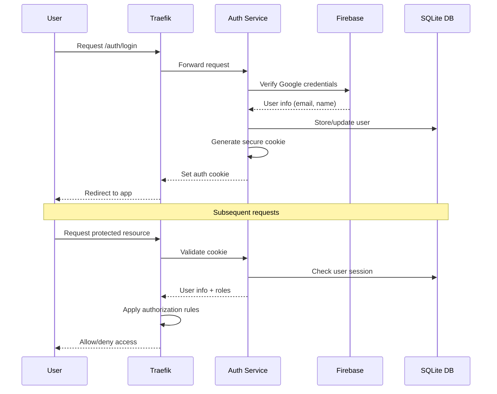
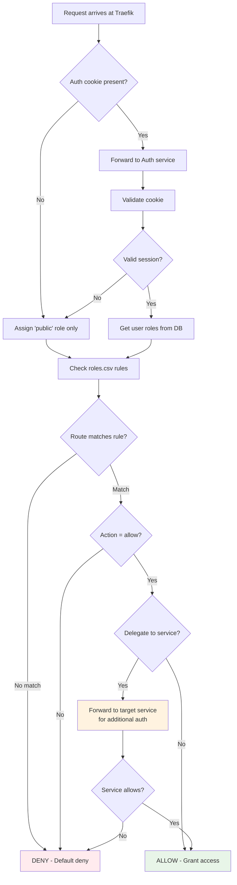

# Photo Web

Photo Web is a web application for playing Apple Photo Albums and viewing documents (markdown, pdf, etc.) in a web browser.

## Features

The application comprises a backend and web client. Access to the backend is exclusively via HTTPS to `${ROOT_DOMAIN}` with a valid certificate. The web client is a single page application (SPA) accessible via HTTP (redirected to HTTPS) or HTTPS.

> [!TIP]
> Encrypted access applies to testing and development (ingress to `localhost` fails). Set up DNS for `${ROOT_DOMAIN}` (e.g., add `127.0.0.1 dev49.org` to `/etc/hosts` on Linux/macOS). Testing strategies include:
>
> * access via docker exec
> * adding testing code to the application and accessing it e.g. with curl or the web client
> * creating special `test` containers

## Architecture Overview

The Photo Web application follows a microservices architecture with clear separation of concerns. The system comprises multiple Docker services orchestrated through docker-compose, with Traefik serving as the single point of ingress and handling SSL termination.

### System Architecture

```mermaid
graph TB
    subgraph "External Access"
        CF[Cloudflare Tunnel]
        HTTPS[HTTPS :443]
        HTTP[HTTP :80]
    end
    
    subgraph "Docker Network"
        T[Traefik<br/>Reverse Proxy]
        A[Auth Service<br/>Firebase + Roles]
        N[Nginx<br/>Static Files + Cache]
        P[Photos Service<br/>Apple Photos API]
        F[Files Service<br/>Document Access]
        AN[Analytics Service<br/>Log Analysis]
    end
    
    subgraph "Frontend"
        SPA[Single Page App<br/>LitElement + TypeScript]
    end
    
    subgraph "Data Sources"
        APL[Apple Photos Library<br/>Read-only Mount]
        FD[Files Directory<br/>${FILES}]
        DB[(SQLite Database<br/>Users & Sessions)]
    end
    
    CF --> T
    HTTPS --> T
    HTTP --> T
    
    T --> A
    T --> N
    T --> P
    T --> F
    T --> AN
    
    N --> SPA
    A --> DB
    P --> APL
    F --> FD
    
    style T fill:#e1f5fe
    style A fill:#f3e5f5
    style N fill:#e8f5e8
    style P fill:#fff3e0
    style F fill:#fce4ec
```

**Figure 1: System Architecture** - The complete Photo Web system showing all services and their relationships. Traefik acts as the central ingress point, routing requests to appropriate services while delegating authentication to the Auth service.

### Authentication Flow



**Figure 2: Authentication Flow** - Shows how users authenticate through Firebase and how sessions are managed. The Auth service creates secure cookies that are validated on subsequent requests.

### Authorization Flow



**Figure 3: Authorization Flow** - Illustrates the role-based authorization process using rules.csv. Some routes can delegate authorization decisions to target services for fine-grained access control.

## Implementation

### Backend

The backend is a docker stack orchestrated by `docker-compose` (see Figure 1 for the complete system architecture). It comprises the following services:

#### Traefik

* The only ingress to the application via
  * port 443
  * port 80 (redirects to port 443)
  * cloudflare tunnel
* Delegates authentication and authorization to the `auth` service (see Figures 2 and 3 for detailed authentication and authorization flows)
* Rate limiting for ingress via cloudflare tunnel (TODO)

#### Auth

The `auth` service uses [Firebase](https://firebase.google.com/) for authentication and implements custom role-based authorization for specific URIs. Built with [FastAPI](https://fastapi.tiangolo.com/), endpoint documentation is available at `https://${ROOT_DOMAIN}/auth/openapi.json` or formatted at `https://${ROOT_DOMAIN}/auth/redoc` and `https://${ROOT_DOMAIN}/auth/docs`.

##### Authentication

The `/auth/login` endpoint verifies users with Firebase (currently only Google login is supported), as illustrated in Figure 2. It automatically adds new users to an SQLite database and stores login credentials in a secure cookie valid for `${AUTH_COOKIE_EXPIRATION_DAYS}` days. The `/auth/logout` endpoint deletes login and session cookies. `/auth/me` returns current user information including name, email, and roles.

##### Authorization

Authorization follows the flow shown in Figure 3 and is based on the user's roles and routes defined in `auth/app/roles.csv`. The file has four columns:

* action: allow or deny
* route pattern (wildcards supported, e.g., `*/redoc`)
* role (e.g., `public`, `private`). Alternatively, this field may delegate to a different authorization service identified by its URI on the internal Docker network (e.g., `!photos:8000`).
* a comment

Sample `roles.csv`:

```csv
allow, /, public, main entry point
allow, /ui*, public, user interface

allow, /auth/firebase-config, public
allow, /auth/login*, public, Login page

allow, /photos/api/albums, public, Public album list
allow, /photos/api/photos/srcset, public, Srcset for images
allow, /photos/api/albums/*, !photos:8000, Delegate album access to photos service
allow, /photos/api/photos/*, !photos:8000, Delegate photo access to photos service
allow, /photos/api/reload-db, admin, Reload photos database

...
```

Routes that match are accepted or denied based on the first matching rule. If no rule matches, access is denied. This process is detailed in the authorization flow diagram (Figure 3).

The application uses the following roles:

* `public`: All visitors (regardless of login status) are assigned this role. Provides access to the user interface and public albums/documents.
* `protected`: Authenticated users are assigned both `public` and `protected` roles by default.
* `private`: Must be explicitly assigned by administrators. Provides access to private albums and documents.
* `admin`: Allows viewing/editing users (especially roles) and reloading the photos database.
* Additional roles specify document access as explained below.

Photo album access works as follows: Albums in the `Public` folder of Apple Photos are available to all users (via the `public` role). Albums in `Protected` require the `protected` role, and albums in `Private` require the `private` role. Matching is case-insensitive. Individual photos inherit their album's access rights. Photos in multiple albums use the least restrictive access rights.

> [!CAUTION]
> The public/protected/private access rights are deeply ingrained in the way the `photos` service works. Modification would require a major refactoring of the service.

Document access is based on folder names in the `${FILES}` directory. Users can only access documents in folders matching their roles (case-insensitive). For example, users with the `private` role can access the `Private` folder but not `Public` or `Protected` folders.

> [!TIP]
> Create a `family` folder in `${FILES}` for family-only content. Add the `family` role to appropriate users. To edit users and roles, log in with an `admin` account (e.g., `SUPER_USER_EMAIL` from `.env`), click the three dots left of your avatar, and select `Users...`.

#### Nginx

The `nginx` service serves static files from the `ui` directory and proxies requests to the `auth`, `files`, and `photos` services. It caches images from the `photos` service. Configuration is in `nginx/nginx-proxy.conf`.

Photo processing (HEIC to JPEG conversion and scaling) is compute-intensive. Nginx caches images to improve performance:

```nginx
# Cache settings for photos - optimized for slow server performance
proxy_cache_path  /var/cache/nginx/photos
                  levels=1:2
                  keys_zone=photos_cache:50m
                  max_size=4g
                  inactive=720h
                  use_temp_path=off
                  manager_files=100
                  manager_threshold=200
                  manager_sleep=300;
```

#### Photos

The `photos` service serves album indices and photos directly from the Apple Photos library (read-only mounted) using [OSXPhotos](https://github.com/RhetTbull/osxphotos). Built with [FastAPI](https://fastapi.tiangolo.com/), endpoint documentation is available at `https://${ROOT_DOMAIN}/photos/openapi.json` or formatted at `https://${ROOT_DOMAIN}/photos/redoc` and `https://${ROOT_DOMAIN}/photos/docs`.

The service doesn't copy the photo library but scales images and converts HEIC to JPEG on-the-fly via `/api/photos/{photo_id}/img{size_suffix}`. Nginx caching speeds up access to frequently requested images.

#### Files

The `files` service provides read-only access to the `${FILES}` folder. Built with [FastAPI](https://fastapi.tiangolo.com/), endpoint documentation is available at `https://${ROOT_DOMAIN}/files/openapi.json` or formatted at `https://${ROOT_DOMAIN}/files/redoc` and `https://${ROOT_DOMAIN}/files/docs`.

#### Analytics

The `analytics` service analyzes Traefik logs. Built with [FastAPI](https://fastapi.tiangolo.com/).

#### Cloudflare Tunnel

The `cloudflared` service creates a secure tunnel to Traefik for worldwide application access.

### Frontend

The frontend is a single-page application (SPA) built with [LitElement](https://lit.dev/) and [Vite](https://vitejs.dev/). Written in TypeScript, it uses [Shoelace](https://shoelace.style/) for UI components. Served by the backend at `https://${ROOT_DOMAIN}`. Main components:

* `pw-main`: Sets up routing and provides contexts for user information and shared data.
* `pw-nav-page`: Main application layout with header navigation and content area.
* `pw-photo-browser`: Interface for browsing Apple Photos library albums.
* `pw-slideshow`: Displays photo albums as slideshows.
* `pw-files-browser`: Browse and view documents in `${FILES}` folder. Renders markdown, PDF, and images.
